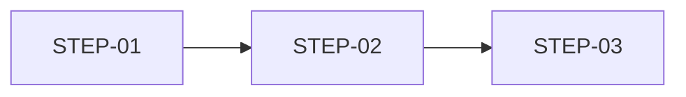

# 전체 운영 사이클

> 시스템 안에서 주요 주체가 거치는 전체 생애주기.
> 각 단계는 하위 Context 문서와 연결됨.

---

## 1. 개요

- **대상 주체**:
- **사이클 범위**: 시스템 진입 ~ 종료까지의 전체 흐름
- **설명**:

---

## 2. 사이클 흐름

| 단계 | 단계명 | 주체 | 시점 / 트리거 | 주기 | 설명 | 상세 |
|:----:|--------|------|------------|:----:|------|------|
|  1   |        |      |            |      |      |      |

**주기 기준:** 일회성 / 수시 / 일별 / 주별 / 월별 / 분기별 / 연별

---

## 3. 흐름 다이어그램

---

## 4. 단계별 상세

### STEP-01 {단계명}

- **주체**:
- **시점/트리거**:
- **주기**: 일회성 / 반복
- **설명**:
- **관련 Context**: 
- **관련 RQ**: 
- **관련 Policy**: 
